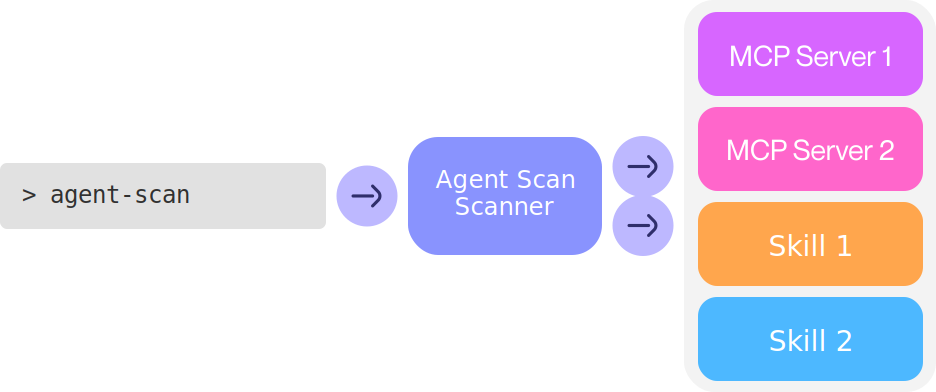

# Scanning with `agent-scan`

Scan your machine for agents, MCP servers, and skills, and detect security vulnerabilities like prompt injections, tool poisoning, toxic flows, or malware payloads. See the [Issue Code Reference](issue-codes.md) for a full list of detected issues.

Agent Scan operates in two main modes which can be used jointly or separately:

1. **Scan Mode**: The CLI command `agent-scan` scans the current machine for agents and agent components such as skills and MCP servers. Upon completion, it will output a comprehensive report for the user to review.

2. **Managed Mode**: Agent Scan runs local analysis by default. Managed deployments can opt into explicit remote analysis with `--analysis-mode remote`, `--analysis-url`, and authorization headers, and agent hooks can forward events to a remote hook server using a pre-provisioned push key.

## Quick Start

To run a full scan of your machine (auto-discovers agents, MCP servers, skills), run:

```bash
uvx agent-scan@latest --skills
```

This will scan for security vulnerabilities in servers, skills, tools, prompts, and resources. It will automatically discover a variety of agent configurations, including Claude Code/Desktop, Cursor, Gemini CLI, and Windsurf.

You can also scan particular configuration files or skills:

```bash
# scan mcp configurations
uvx agent-scan@latest ~/.vscode/mcp.json
# scan a single agent skill
uvx agent-scan@latest  --skills ~/path/to/my/SKILL.md
# scan all claude skills
uvx agent-scan@latest  --skills ~/.claude/skills
```

## How It Works



Agent Scan searches through your local agent's configuration files to find agents, skills, and MCP servers. For MCP, it connects to servers and retrieves tool descriptions. Omit `--skills` to skip skill analysis.

It then validates components with local checks by default. Remote analysis is optional and explicit through `--analysis-mode remote`, `--analysis-provider`, `--analysis-url`, and `--verification-H`.

Agent Scan does not store or log any usage data, i.e. the contents and results of your MCP tool calls.

## CLI Parameters

```
agent-scan - Security scanner for agents, MCP servers, and skills
```

### Common Options

These options are available for all commands:

```
--storage-file FILE    Path to store scan results and scanner state (default: ~/.agent-scan)
--analysis-url URL     Remote analysis endpoint, used only for explicit remote analysis
--analysis-mode MODE   Choose auto, local, or remote analysis (default: auto)
--analysis-provider    Analysis provider for remote analysis selection
--verification-H       Additional header for the remote analysis endpoint
--verbose              Enable detailed logging output
--print-errors         Show error details and tracebacks
--json                 Output results in JSON format instead of rich text
```

### Commands

#### scan (default)

Scan MCP configurations for security vulnerabilities in tools, prompts, and resources.

```
agent-scan scan [CONFIG_FILE...]
```

Options:

```
--checks-per-server NUM           Number of checks to perform on each server (default: 1)
--server-timeout SECONDS          Seconds to wait before timing out server connections (default: 10)
--suppress-mcpserver-io BOOL      Suppress stdout/stderr from MCP servers (default: True)
--skills                          Autodetects and analyzes skills
--skills PATH_TO_SKILL_MD_FILE    Analyzes the specific skill
--skills PATHS_TO_DIRECTORY       Recursively detects and analyzes all skills in the directory
```

#### inspect

Print descriptions of tools, prompts, and resources without verification.

```
agent-scan inspect [CONFIG_FILE...]
```

Options:

```
--server-timeout SECONDS      Seconds to wait before timing out server connections (default: 10)
--suppress-mcpserver-io BOOL  Suppress stdout/stderr from MCP servers (default: True)
```

#### help

Display detailed help information and examples.

```bash
agent-scan help
```

### Examples

```bash
# Scan all known MCP configs
agent-scan

# Scan a specific config file
agent-scan ~/custom/config.json

# Just inspect tools without verification
agent-scan inspect
```
