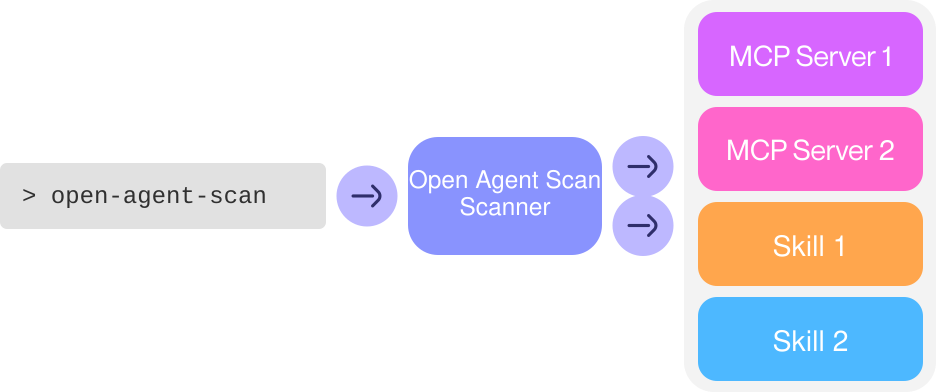

# Scanning with `open-agent-scan`

Scan your machine for agents, MCP servers, and skills, and detect security vulnerabilities like prompt injections, tool poisoning, toxic flows, or malware payloads. See the [Issue Code Reference](issue-codes.md) for a full list of detected issues.

Open Agent Scan operates in two main modes which can be used jointly or separately:

1. **Scan Mode**: The CLI command `open-agent-scan` scans the current machine for agents and agent components such as skills and MCP servers. Upon completion, it will output a comprehensive report for the user to review.

2. **Managed Mode**: Open Agent Scan runs local analysis by default. Managed deployments can opt into explicit remote analysis with `--analysis-mode remote`, `--analysis-url`, and authorization headers, and agent hooks can forward events to a remote hook server using a pre-provisioned push key.

## Quick Start

To run a full scan of your machine (auto-discovers agents, MCP servers, and skills), run:

```bash
uvx open-agent-scan@latest
```

This will scan for security vulnerabilities in servers, skills, tools, prompts, and resources. It will automatically discover a variety of agent configurations, including Claude Code/Desktop, Cursor, Gemini CLI, and Windsurf.

You can also scan particular configuration files or skills:

```bash
# scan an MCP configuration
uvx open-agent-scan@latest ~/.vscode/mcp.json
# scan a single agent skill
uvx open-agent-scan@latest ~/path/to/my/SKILL.md
# scan all claude skills
uvx open-agent-scan@latest ~/.claude/skills
# MCP only (skip skills)
uvx open-agent-scan@latest --no-skills
```

## How It Works



Open Agent Scan searches through your local agent's configuration files to find agents, skills, and MCP servers. For MCP, it connects to servers and retrieves tool descriptions. Skills are scanned by default; use `--no-skills` to skip skill analysis.

It then validates components with local checks by default. Remote analysis is optional and explicit; when enabled, scanned component metadata is sent to the configured remote analysis endpoint.

Open Agent Scan does not store or log any usage data, i.e. the contents and results of your MCP tool calls.

## CLI Parameters

For the complete, up-to-date list of commands, flags, options, environment variables, and exit codes, see **[CLI reference](cli-reference.md)**.

Quick summary:

- **Default command:** `scan` (omit the subcommand to scan well-known agent configs)
- **`inspect`:** discovery and MCP handshake only — no security analysis
- **Skills:** included by default; use `--no-skills` for MCP-only (`--skills` is deprecated — see [CLI reference](cli-reference.md))
- **`--ci`:** non-zero exit on findings (requires `--dangerously-run-mcp-servers` in CI)
- **`--json`:** machine-readable output — see [JSON output](json-output.md)

### Examples

```bash
# Scan all known MCP configs and agent skills
open-agent-scan

# Scan a specific config file
open-agent-scan ~/custom/config.json

# MCP only
open-agent-scan --no-skills

# Just inspect tools without verification
open-agent-scan inspect

# CI mode
open-agent-scan --ci --dangerously-run-mcp-servers
```
